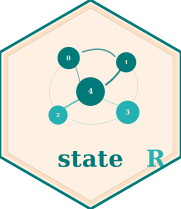

# 🧠 stateR 

An R package for characterising **brain state dynamics** from functional connectivity time series — computing fractional occupancy, dwell time, and Markov-chain transition probabilities across states.

[](https://doi.org/10.1038/s41467-023-44050-z)
[](./LICENSE)
[](https://www.r-project.org/)
[](https://github.com/CoDe-Neuro/stateR)

---

## 📖 What is stateR?

`stateR` provides a tidy, `tidyverse`-compatible toolkit for quantifying how the brain moves through discrete functional states over time. Given a data frame of state labels at each time point — typically derived from k-means or HMM clustering of dynamic functional connectivity matrices — the package computes three core brain-state metrics:

- **Fractional occupancy** — how often each state is visited
- **Dwell time** — how long each state is continuously occupied
- **Markov transition probabilities** — the likelihood of moving from one state to another

All functions return nested tibbles that slot naturally into grouped `purrr::map` pipelines, making `stateR` especially well suited for multi-subject neuroimaging studies.

The package was developed for and is used in:

> França LGS, Ciarrusta J, Gale-Grant O, Fenn-Moltu S, Fitzgibbon S, Chew A, Falconer S, Dimitrova R, Cordero-Grande L, Price AN, Hughes E, O'Muircheartaigh J, Duff E, Tuulari JJ, Deco G, Counsell SJ, Hajnal JV, Nosarti C, Arichi T, Edwards AD, McAlonan G, Batalle D (2024).
> Neonatal brain dynamic functional connectivity in term and preterm infants and its association with early childhood neurodevelopment.
> *Nature Communications*, 15, 16. https://doi.org/10.1038/s41467-023-44050-z

In that study, `nest_fo`, `nest_dwell`, and `clusters_markov` were applied to resting-state fMRI brain state sequences derived from k-means clustering of dynamic functional connectivity in 390 term- and preterm-born neonates from the developing Human Connectome Project (dHCP), to characterise how state occupancy and transitions relate to postmenstrual age, preterm birth, and 18-month neurodevelopmental outcomes (Bayley-III, Q-CHAT).

---

## ✨ Features

- 🔁 **Fractional occupancy** — proportion of total time spent in each state per subject/group (`nest_fo`)
- ⏱️ **Dwell time** — mean continuous occupancy duration per state, excluding single time-point visits (`nest_dwell`)
- 🔀 **Markov transition matrix** — pairwise transition counts and normalised probabilities, with optional removal of self-transitions (`clusters_markov`)
- 📦 **Tidy outputs** — all functions return nested tibbles, ready for `unnest()` and downstream statistical testing with [`ptestR`](https://github.com/CoDe-Neuro/ptestR)
- 🧩 **Grouped pipeline-friendly** — designed for `dplyr::group_by` + `purrr::map` workflows across subjects, sessions, or conditions

---

## 🗂️ Project Structure

```
stateR/
├── R/
│   ├── clusters_markov.R   # Markov transition probability computation
│   ├── dwellCount.R        # Internal helper: run-length encoding of state sequences
│   ├── nest_dwell.R        # Mean dwell time per state, nested by state
│   └── nest_fo.R           # Fractional occupancy per state, nested by state
├── man/                    # Roxygen2-generated documentation
├── DESCRIPTION
├── NAMESPACE
└── stateR.Rproj
```

---

## 🚀 Getting Started

### Prerequisites

- R ≥ 4.0
- The following packages (installed automatically as dependencies):

| Package | Role |
|---------|------|
| `dplyr` | Data manipulation |
| `tidyr` | Reshaping and nesting outputs |
| `purrr` | Functional iteration over state sequences |
| `janitor` | Tabulation for fractional occupancy (`tabyl`) |
| `glue` | String interpolation for transition tags |

### Installation

`stateR` is not on CRAN. Install directly from GitHub:

```r
# install.packages("remotes")  # if needed
remotes::install_github("CoDe-Neuro/stateR")
```

### Quick example

```r
library(stateR)
library(dplyr)
library(tidyr)

# Example: 3 subjects, 20 time points each, 4 possible states (0–3)
set.seed(42)
tbl <- tibble::tibble(
  subject = rep(c("sub-01", "sub-02", "sub-03"), each = 20),
  session = rep("ses-01", 60),
  time    = rep(1:20, 3),
  state   = sample(0:3, 60, replace = TRUE)
)

# Fractional occupancy
fo <- nest_fo(tbl,
              vars  = c("subject", "session"),
              foVar = "state")

# Dwell time
dwell <- nest_dwell(tbl,
                    vars   = c("subject", "session"),
                    foVar  = "state",
                    sortBy = "time")

# Markov transitions
trans <- clusters_markov(tbl,
                         vars     = c("subject", "session"),
                         cVar     = "state",
                         sortBy   = "time",
                         groupBy  = "subject",
                         remIntra = FALSE)
```

---

## 🔧 Function Reference

### `nest_fo()`

Estimates the **fractional occupancy** — the proportion of total time points that a subject/group spends in each state.

```r
nest_fo(tbl, vars, foVar)
```

| Argument | Type | Description |
|----------|------|-------------|
| `tbl` | tibble / data frame | Long-format data with one row per subject per time point |
| `vars` | character vector | Grouping variables (e.g. `c("subject", "session", "group")`) |
| `foVar` | character | Column name containing the state label at each time point |

**Returns** a nested tibble with one row per state. Each row contains a `data` list-column holding a tibble of fractional occupancy (`perc`) per grouping combination.

**Example output structure:**

```
# A tibble: 4 × 2
  cluster data
  <chr>   <list>
1 0       <tibble [90 × 3]>
2 1       <tibble [90 × 3]>
3 2       <tibble [90 × 3]>
4 3       <tibble [90 × 3]>
```

**Typical pipeline:**

```r
nest_fo(tbl, vars = c("subject", "group"), foVar = "state") %>%
  tidyr::unnest(data) %>%
  dplyr::filter(cluster == "2") %>%
  ptestR::grouped_perm_glm(perc ~ group, "perc")
```

---

### `nest_dwell()`

Estimates the **mean dwell time** — the average number of consecutive time points a subject/group spends in an uninterrupted visit to each state. Single time-point visits (dwell = 1) are excluded from the mean.

```r
nest_dwell(tbl, vars, foVar, sortBy)
```

| Argument | Type | Description |
|----------|------|-------------|
| `tbl` | tibble / data frame | Long-format data with one row per subject per time point |
| `vars` | character vector | Grouping variables (e.g. `c("subject", "session")`) |
| `foVar` | character | Column name containing the state label at each time point |
| `sortBy` | character | Column name of the time index used to order observations before run-length encoding |

**Returns** a nested tibble with one row per state. Each `data` list-column holds a tibble of mean dwell time (`mean_dwell`) per grouping combination.

**Note:** The internal helper `dwellCount()` performs run-length encoding on the ordered state sequence. Only transitions that persist for more than a single time point contribute to `mean_dwell`.

**Example:**

```r
nest_dwell(tbl,
           vars   = c("subject", "session"),
           foVar  = "state",
           sortBy = "time") %>%
  tidyr::unnest(data) %>%
  dplyr::filter(cluster == "1")
```

---

### `clusters_markov()`

Computes **Markov transition probabilities** between states. For each source state, the function counts all observed transitions to each target state and normalises by the total number of transitions out of that source state. The analysis is memoryless (first-order Markov), treating all transitions equally regardless of history.

```r
clusters_markov(tbl, vars, cVar, sortBy, groupBy, remIntra = FALSE)
```

| Argument | Type | Description |
|----------|------|-------------|
| `tbl` | tibble / data frame | Long-format data with one row per subject per time point |
| `vars` | character vector | Variables to carry through to the output (typically grouping + covariate columns) |
| `cVar` | character | Column name containing the state label at each time point |
| `sortBy` | character | Column name of the time index used to order observations before computing transitions |
| `groupBy` | character | Grouping variable for computing transitions (e.g. `"subject"`) |
| `remIntra` | logical | If `TRUE`, self-transitions (state → same state) are removed before computing probabilities (default: `FALSE`) |

**Returns** a nested tibble with one row per unique source–target transition `tag` (e.g. `"0_2"`). Each `data` list-column contains normalised transition probabilities (`nCount`) and raw counts (`n`) per grouping combination.

**Transition tag format:** `"<source>_<target>"` — for example, `"2_0"` denotes a transition from state 2 to state 0.

**Example:**

```r
clusters_markov(tbl,
                vars     = c("subject", "group"),
                cVar     = "state",
                sortBy   = "time",
                groupBy  = "subject",
                remIntra = TRUE) %>%
  tidyr::unnest(data) %>%
  dplyr::filter(tag == "0_2") %>%
  ptestR::grouped_perm_glm(nCount ~ group, "nCount")
```

---

## 📐 Output Structure

All three exported functions return **state-nested tibbles** — one row per state (or per transition pair for `clusters_markov`), with a `data` list-column for downstream analysis:

| Function | Nesting key | Key output column | Unit |
|----------|-------------|-------------------|------|
| `nest_fo()` | `cluster` | `perc` | Proportion (0–1) |
| `nest_dwell()` | `cluster` | `mean_dwell` | Time points |
| `clusters_markov()` | `tag` (e.g. `"0_2"`) | `nCount` | Probability (0–1) |

This nesting structure is intentional: it mirrors the output of `ptestR` functions and makes it straightforward to apply statistical tests per state or per transition using `purrr::map`.

---

## 📄 Citation

If you use `stateR` in your research, please cite the paper it was developed for:

```bibtex
@article{franca2024neonatal,
  title   = {Neonatal brain dynamic functional connectivity in term and preterm infants
             and its association with early childhood neurodevelopment},
  author  = {Fran{\c{c}}a, Lucas G. S. and Ciarrusta, Judit and Gale-Grant, Oliver and
             Fenn-Moltu, Sunniva and Fitzgibbon, Sean and Chew, Andrew and
             Falconer, Shona and Dimitrova, Ralica and Cordero-Grande, Lucilio and
             Price, Anthony N. and Hughes, Emer and O'Muircheartaigh, Jonathan and
             Duff, Eugene and Tuulari, Jetro J. and Deco, Gustavo and
             Counsell, Serena J. and Hajnal, Joseph V. and Nosarti, Chiara and
             Arichi, Tomoki and Edwards, A. David and McAlonan, Grainne and
             Batalle, Dafnis},
  journal = {Nature Communications},
  volume  = {15},
  pages   = {16},
  year    = {2024},
  doi     = {10.1038/s41467-023-44050-z}
}
```

---

## 👥 Authors

| Role | Name | Affiliation |
|------|------|-------------|
| Author, maintainer | Lucas G. S. França | King's College London |
| Author | Dafnis Batallé | King's College London |

Part of the [CoDe-Neuro Lab](https://github.com/CoDe-Neuro) at King's College London.

---

## 🤝 Related Tools

- 🧪 [**ptestR**](https://github.com/CoDe-Neuro/ptestR) — Permutation-based significance testing for GLMs, LMMs, and logistic regression; designed to work directly with `stateR` outputs

---

## 📄 Licence

Released under the [MIT License](./LICENSE).

Copyright © Lucas G. S. França and Dafnis Batallé, 2024
